# Components

Every component below ships with the layer and is globally available — no
import. Screenshots are generated from `playground/`; see
[Regenerating](#regenerating) at the bottom.

Each file carries its own reasoning in the header comment: what it does, when
it is the right choice, and when it is not. What follows is the short version.

- [Structure](#structure) — [BaseKitTabs](#basekittabs) · [BaseKitSettingRow](#basekitsettingrow) · [BaseKitFormSection](#basekitformsection) · [BaseKitResizeHandle](#basekitresizehandle) · [BaseKitEmptyState](#basekitemptystate) · [BaseKitChoiceCard](#basekitchoicecard) · [BaseKitPending](#basekitpending)
- [Lists](#lists) — [BaseKitDataTable](#basekitdatatable) · [BaseKitStatTile](#basekitstattile)
- [Pickers](#pickers) — [BaseKitRecordPicker](#basekitrecordpicker) · [BaseKitIconPicker](#basekiticonpicker) · [BaseKitFileUpload](#basekitfileupload)
- [Navigation](#navigation) — [BaseKitBackLink](#basekitbacklink) · [BaseKitViewLink](#basekitviewlink)
- [Confirmation](#confirmation) — [BaseKitConfirmModal](#basekitconfirmmodal)
- [Text](#text) — [BaseKitMarkdownEditor](#basekitmarkdowneditor)
- [Charts](#charts) — [BaseKitChartFigure](#basekitchartfigure) · [BaseKitChartBars](#basekitchartbars) · [BaseKitChartColumns](#basekitchartcolumns) · [BaseKitChartDonut](#basekitchartdonut) · [BaseKitChartMeter](#basekitchartmeter)

---

## Structure

### BaseKitTabs

Splits a page into sections — one named slot per tab, keyed by `key`. The
active tab is optional via `v-model`; without it the first one wins.

With `hash-nav` the active tab becomes addressable through the URL fragment
(`…/page#access`). Run only **one** tabset per page with `hash-nav`, and note
that the hash is applied `onMounted` on purpose: the server never sees it, so
a differing first render would be a hydration mismatch.

<picture>
  <source media="(prefers-color-scheme: dark)" srcset="docs/media/BaseKitTabs-dark.png">
  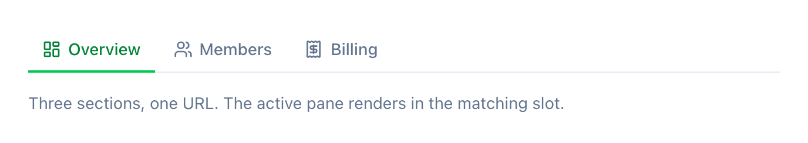
</picture>

```vue
<BaseKitTabs :items="[
  { key: 'general', label: 'General', icon: 'i-lucide-settings' },
  { key: 'access', label: 'Access', icon: 'i-lucide-lock' },
]">
  <template #general>…</template>
  <template #access>…</template>
</BaseKitTabs>
```

### BaseKitSettingRow

One setting inside a settings card. Title and control share a line, the
description sits underneath, aligned with the title. The `meta` slot takes an
extra line below the description.

<picture>
  <source media="(prefers-color-scheme: dark)" srcset="docs/media/BaseKitSettingRow-dark.png">
  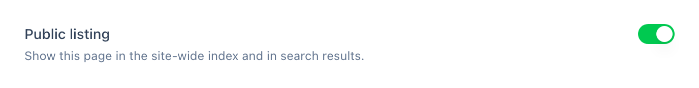
</picture>

```vue
<BaseKitSettingRow title="Notifications" description="Receive email and push">
  <USwitch v-model="notifications" />
</BaseKitSettingRow>
```

### BaseKitFormSection

A named group of fields inside a form: heading, optional description, fields
below. The point is the type ladder — section title `text-base font-semibold`,
section description `text-sm` muted, then `UFormField`'s own `text-sm
font-medium` label and `text-xs` help. A hand-rolled heading tends to land on
field-label weight, and the section then reads as a sibling of the fields it
contains.

Not a card and not a box. Framing every group turns a page of settings into a
page of boxes.

<picture>
  <source media="(prefers-color-scheme: dark)" srcset="docs/media/BaseKitFormSection-dark.png">
  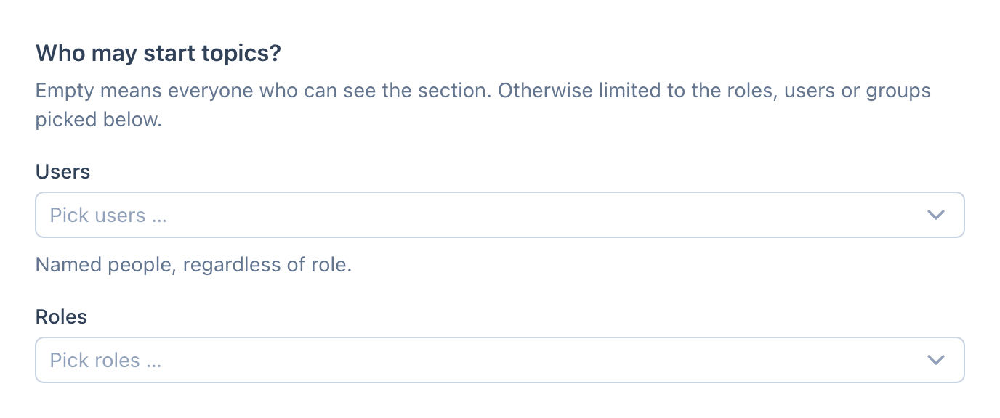
</picture>

```vue
<BaseKitFormSection title="Who may start topics?" description="Empty means everyone who can see it.">
  <UFormField label="Users"><USelectMenu … /></UFormField>
  <UFormField label="Roles"><USelectMenu … /></UFormField>
</BaseKitFormSection>
```

### BaseKitResizeHandle

The edge between two panes, grabbed to move it. A fixed side panel is a guess
about content nobody has seen yet: three settings fit into 300 px, eleven do
not. Making the guess adjustable costs a strip of eight pixels.

The handle owns no width. It reports what the pointer did — `width` in,
`update:width` out — so the page decides what to do with the number and where
to keep it. `side` says which edge it sits on, so dragging widens rather than
narrows on either side of the screen.

Reachable without a pointer: it is a `separator` carrying its value, the arrow
keys move it in steps (times four with Shift), Home and End go to the limits.
A double click returns to `reset`, if one is given.

```vue
<BaseKitResizeHandle v-model:width="width" :min="280" :max="560" :reset="300" />
<aside :style="{ width: `${width}px` }"> … </aside>
```

### BaseKitEmptyState

Icon, an action-shaped headline, optional explanation, optional primary action
in the default slot.

`variant` separates the two cases that look alike and mean different things:
`empty` says nothing has been created yet and leads to the first step;
`search` confirms the query ran and offers a correction.

<picture>
  <source media="(prefers-color-scheme: dark)" srcset="docs/media/BaseKitEmptyState-dark.png">
  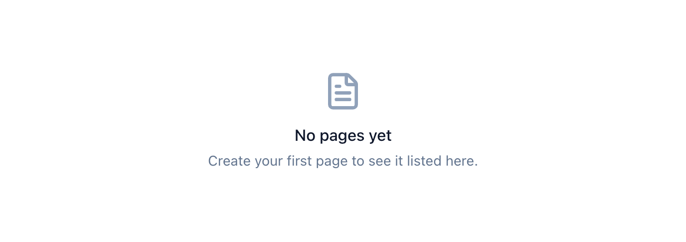
</picture>

```vue
<BaseKitEmptyState title="No pages yet" description="Create your first page.">
  <UButton icon="i-lucide-plus">New page</UButton>
</BaseKitEmptyState>
```

### BaseKitChoiceCard

Pick one of a handful of variants that can be *shown* — themes, layouts,
templates. A dropdown gives you names only; here the preview sits right next
to the label. The `preview` slot takes the rendering.

<picture>
  <source media="(prefers-color-scheme: dark)" srcset="docs/media/BaseKitChoiceCard-dark.png">
  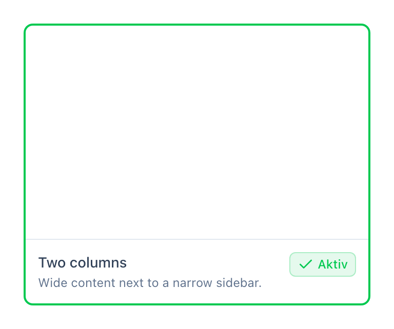
</picture>

```vue
<BaseKitChoiceCard
  v-for="o in options" :key="o.id"
  :title="o.label" :active="o.id === activeId"
  @apply="activeId = o.id"
>
  <template #preview><MyPreview :option="o" /></template>
</BaseKitChoiceCard>
```

### BaseKitPending

A spinner while data is on its way, then the content.

Without it an empty form shows up first and fills itself a blink later. Whoever
types fast writes into a field that is about to be overwritten; whoever reads
slowly takes the record for empty. The spinner says *in a moment*, the empty
form says *nothing here* — and only one of those is true.

Set `label` only where the operation takes a while and has a name. On an
ordinary form the bare spinner is more honest than a word nobody reads.

<picture>
  <source media="(prefers-color-scheme: dark)" srcset="docs/media/BaseKitPending-dark.png">
  
</picture>

```vue
<BaseKitPending :pending="pending">
  <UForm …>
</BaseKitPending>
```

---

## Lists

### BaseKitDataTable

Sortable columns, a text filter and a create button. Client-side throughout —
rows are handed in, not fetched.

Cells render `row[key]` by default and are overridable per column via
`#cell-<key>="{ row, value }"`. Row actions go into `#actions="{ row }"`,
extra filters into `#toolbar`. `row-link` makes a column clickable: the
function receives the row and returns its target, or `null` where there is
none. Generic over the row type `T`, so slots hand `row` back typed.

<picture>
  <source media="(prefers-color-scheme: dark)" srcset="docs/media/BaseKitDataTable-dark.png">
  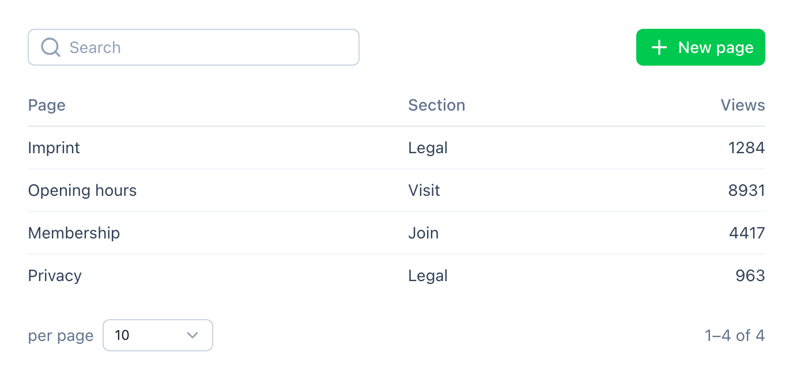
</picture>

```vue
<BaseKitDataTable
  :columns="[{ key: 'title', label: 'Page', sortable: true }]"
  :rows="pages"
  :row-link="(row) => `/pages/${row.id}`"
  create-label="New page"
  @create="…"
/>
```

### BaseKitStatTile

A number with a label — the right shape for a single value.

A bar chart with exactly one bar says no more than the number itself and costs
four times the space. `tone` only colours when the value is above zero: *0 open
items* is not a warning, it is the normal state. The dot next to the number
carries the same message as the colour, because colour alone is none for
red-green deficiency.

<picture>
  <source media="(prefers-color-scheme: dark)" srcset="docs/media/BaseKitStatTile-dark.png">
  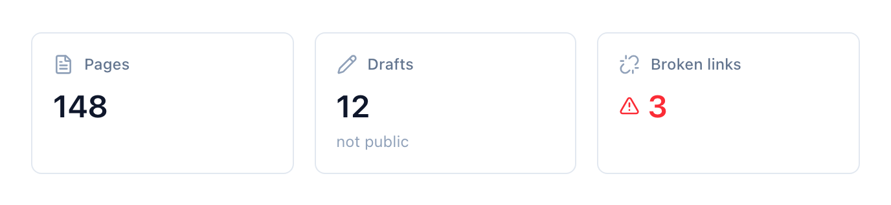
</picture>

```vue
<BaseKitStatTile label="Broken links" :value="3" tone="alert" icon="i-lucide-unlink" />
```

---

## Pickers

### BaseKitRecordPicker

Picks a record across one or several models. The list opens in a modal and
filters by text **and** type. Nothing selected shows a *Select* button;
something selected shows the title (linking to its edit form), a type badge
and a *Change* button.

Model-agnostic — the caller supplies `items`, `v-model` is the option's
`value` or `null`.

<picture>
  <source media="(prefers-color-scheme: dark)" srcset="docs/media/BaseKitRecordPicker-dark.png">
  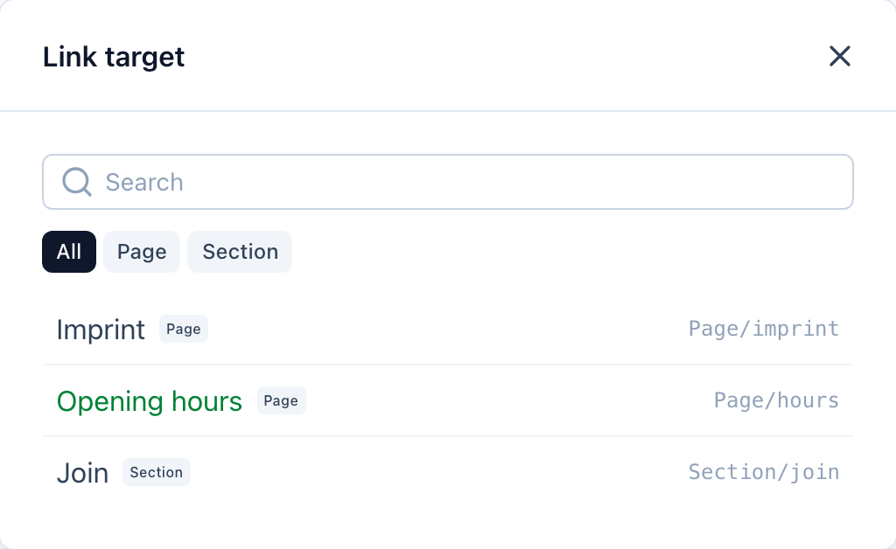
</picture>

```vue
<BaseKitRecordPicker
  v-model="targetId"
  :items="[{ value: 1, label: 'Imprint', type: 'Page', editHref: '/pages/1' }]"
  title="Link target"
/>
```

### BaseKitIconPicker

A form control for `i-lucide-*` names — display plus picker, no free text.
The trigger shows the chosen icon, a click opens a popover with search and a
grid of curated icons. `modelValue` is the icon name; an empty string means
*no icon*.

Curated on purpose rather than the full Iconify set: that keeps the bundle
small and needs no extra data source. When an icon is missing, the list in the
file grows by one line.

<picture>
  <source media="(prefers-color-scheme: dark)" srcset="docs/media/BaseKitIconPicker-dark.png">
  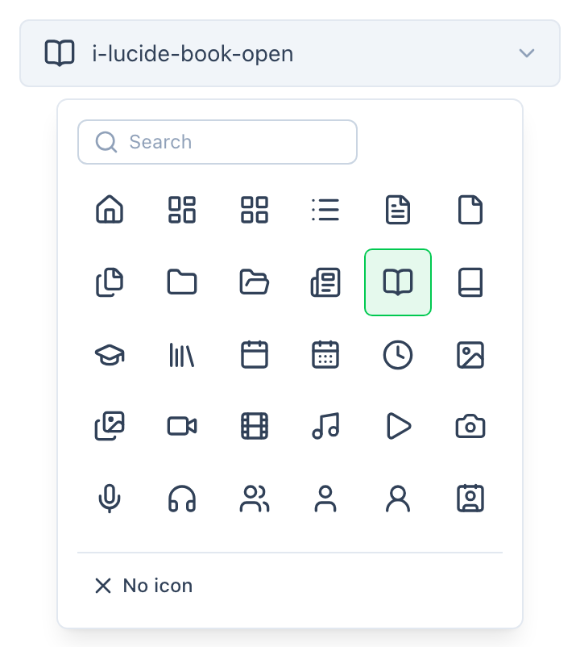
</picture>

```vue
<BaseKitIconPicker v-model="icon" />
```

### BaseKitFileUpload

File selection by click or drag and drop. Hands the files up through `select`
and does **not** upload them itself — that stays with the caller, who knows
whether this is an image or a video.

<picture>
  <source media="(prefers-color-scheme: dark)" srcset="docs/media/BaseKitFileUpload-dark.png">
  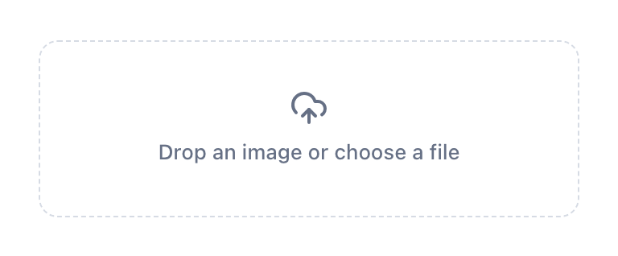
</picture>

```vue
<BaseKitFileUpload accept="image/*" @select="(files) => upload(files[0])" />
```

---

## Navigation

### BaseKitBackLink

The way back from a detail page to its list. Always in the same spot, always
the same wording — and the wording names the *direction*, not the target.

Before that every page solved it differently: sometimes a button above the
heading, sometimes a small link, labelled either with the name of the list or
with *Back*. Anyone moving between two areas had to find the way back anew
each time. `label` overrides it where the way back leads to a parent record
rather than a list.

<picture>
  <source media="(prefers-color-scheme: dark)" srcset="docs/media/BaseKitBackLink-dark.png">
  
</picture>

```vue
<BaseKitBackLink to="/pages" />
```

### BaseKitViewLink

The way from an edit form to the public view of the same thing — the
counterpart to the context actions that live in the view.

**Only render it when the view exists.** A freshly created record has none,
and a link into nowhere is worse than no link. That is why the `v-if` belongs
at the call site, where it is known whether anything has been saved.

<picture>
  <source media="(prefers-color-scheme: dark)" srcset="docs/media/BaseKitViewLink-dark.png">
  
</picture>

```vue
<BaseKitViewLink v-if="page.slug" :to="`/${page.slug}`" />
```

---

## Confirmation

### BaseKitConfirmModal

A themed replacement for `window.confirm`, driven by the `basekit:confirm`
store. Mount exactly one instance per layout — it answers every question.
Destructive actions get a red confirm button; closing without a click (Escape,
backdrop) counts as cancel.

<picture>
  <source media="(prefers-color-scheme: dark)" srcset="docs/media/BaseKitConfirmModal-dark.png">
  
</picture>

```vue
<!-- once, in app.vue or the layout -->
<BaseKitConfirmModal />
```

```ts
const confirm = useConfirm()
if (!(await confirm({ description: 'This cannot be undone.', color: 'error' }))) return
```

---

## Text

### BaseKitMarkdownEditor

A WYSIWYG editor whose `v-model` is a **Markdown string**.

Tiptap works in HTML internally; the bridge to Markdown runs through two
established libraries rather than a Tiptap Markdown plugin, which survives
version bumps better: markdown-it on the way in, turndown on the way out. The
editor is created `onMounted` because ProseMirror needs a DOM — SSR-safe.

<picture>
  <source media="(prefers-color-scheme: dark)" srcset="docs/media/BaseKitMarkdownEditor-dark.png">
  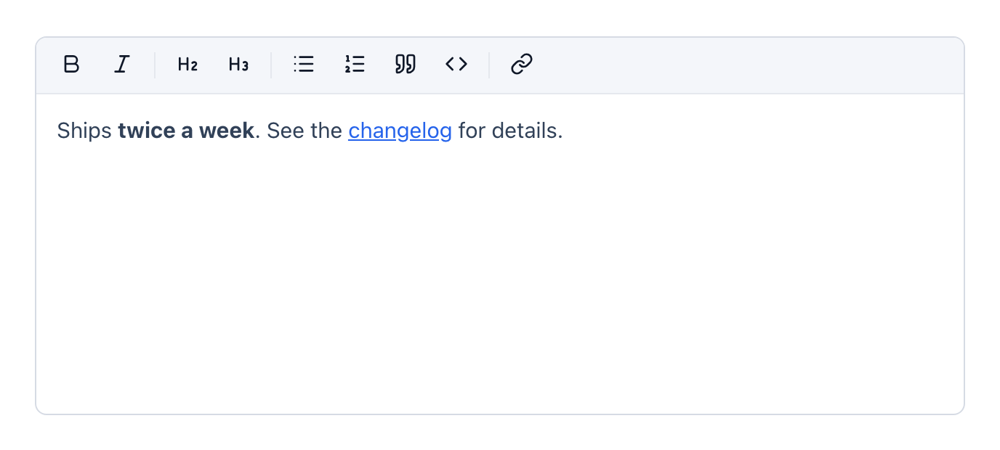
</picture>

```vue
<BaseKitMarkdownEditor v-model="body" />
```

---

## Charts

All five read their colours from `--basekit-chart-1` … `-5`. The set is
validated as a set — lightness band, chroma, neighbour distance, colour vision
deficiency included. Override it as a set, not one by one.

### BaseKitChartFigure

The frame around a chart: card, title, legend, and the switch to the table
view.

That switch is not a nicety. A chart encodes values through colour and length;
anyone who gets nothing out of that — colour vision deficiency, a screen
reader, a printout — needs the same numbers in readable form. So every card
brings its table along, and the switch is visible rather than buried in a menu.

<picture>
  <source media="(prefers-color-scheme: dark)" srcset="docs/media/BaseKitChartFigure-dark.png">
  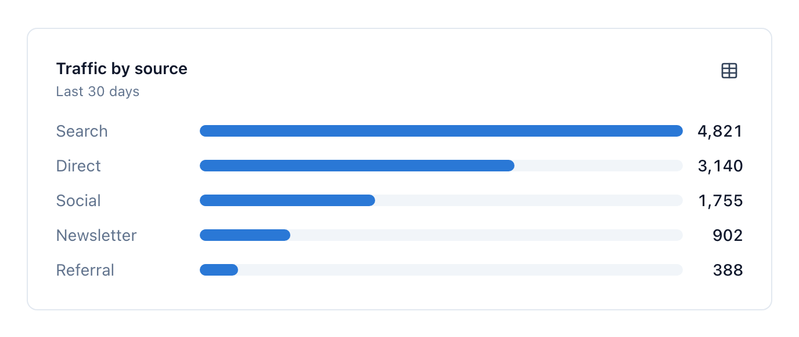
</picture>

```vue
<BaseKitChartFigure title="Traffic by source" subtitle="Last 30 days">
  <BaseKitChartBars :items="items" />
  <template #table><MyTable :items="items" /></template>
</BaseKitChartFigure>
```

### BaseKitChartBars

Horizontal bars for nominal categories — roles, types, sources.

Horizontal because the labels are names, and names under a vertical column
would have to be tilted. All bars share **one** colour: the categories have no
inherent order, and a gradient by size would tell the length a second time
instead of adding information.

<picture>
  <source media="(prefers-color-scheme: dark)" srcset="docs/media/BaseKitChartBars-dark.png">
  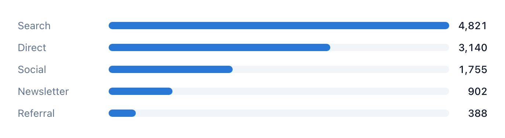
</picture>

```vue
<BaseKitChartBars :items="[{ key: 'search', label: 'Search', value: 4821 }]" :limit="6" />
```

### BaseKitChartColumns

Stacked columns over a time axis — what accrued per day.

Stacked rather than several lines because the question is share of the whole,
not the course of individual series. Columns rather than an area because daily
values are counted events, not a continuous quantity: an area would
interpolate between two days and claim something half-happened at midnight.
Five series at most.

<picture>
  <source media="(prefers-color-scheme: dark)" srcset="docs/media/BaseKitChartColumns-dark.png">
  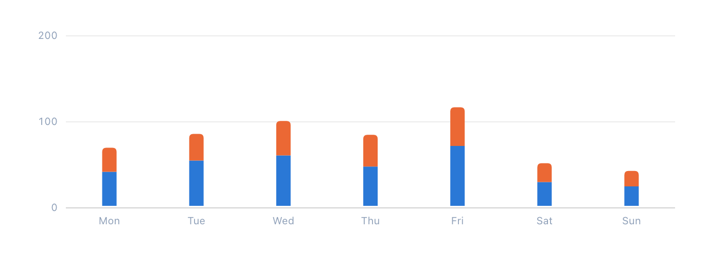
</picture>

```vue
<BaseKitChartColumns
  :categories="['Mon', 'Tue', 'Wed']"
  :series="[{ key: 'new', label: 'New', points: [42, 55, 61] }]"
/>
```

### BaseKitChartDonut

Part-of-whole for a few classes, with the total in the middle.

Deliberately narrow in scope: a ring answers *roughly how does this split*, not
*which of these two is bigger*. As soon as two segments sit close together, a
bar is the more honest shape. Four segments at most, otherwise the small ones
lose their labels.

<picture>
  <source media="(prefers-color-scheme: dark)" srcset="docs/media/BaseKitChartDonut-dark.png">
  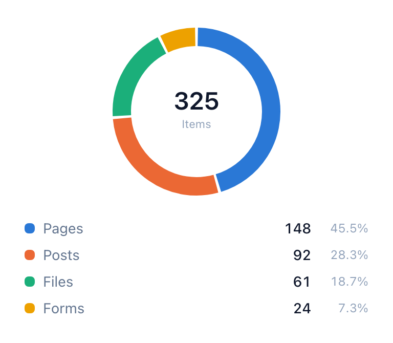
</picture>

```vue
<BaseKitChartDonut :slices="slices" center-label="Items" />
```

### BaseKitChartMeter

A ratio against a known limit — *this many of that many*.

A meter presupposes that a whole exists. Where none does (bytes without a
quota, a count without a ceiling) the number belongs in a tile instead: a full
bar would otherwise claim a limit had been reached.

<picture>
  <source media="(prefers-color-scheme: dark)" srcset="docs/media/BaseKitChartMeter-dark.png">
  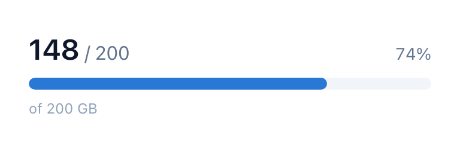
</picture>

```vue
<BaseKitChartMeter :value="148" :total="200" label="Storage used" />
```

---

## Regenerating

The screenshots come from `playground/`, a small Nuxt app that pulls the layer
in the way a consumer would. Every block there carries a `data-shot` with the
component name; the script picks those up and shoots each one twice, light and
dark.

```bash
cd playground
npm install
npm run dev          # leave running

# in a second shell, from the repository root
python3 scripts/shots.py http://localhost:3000
```

Adding a component means adding a block in `playground/app/pages/index.vue` —
the script needs no edit. Components that show nothing but a button while
closed are listed in `OPENED` at the top of the script; those get clicked open
before the shot.